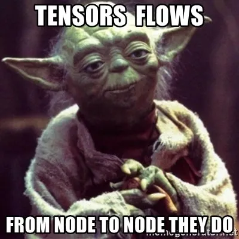
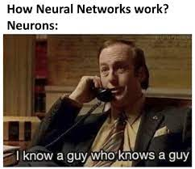
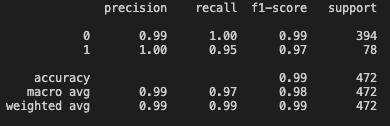
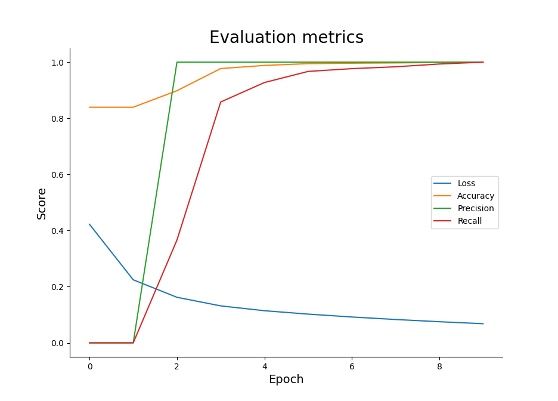
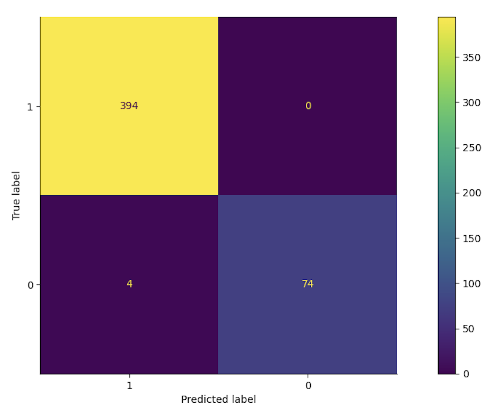

# Binary Classification with Tensorflow

Using Tensorflow and Keras I created a 
Neural Network with the Internet Advertisements data set to predict which instances are ads or not.

## What is [Tensorflow](https://www.tensorflow.org)?



Tensorflow is an open source Python Library. The library serves as an end to end platform for machine learning. Often, and in this project, [Keras API](https://keras.io/about/) is used on top of Tensorflow.


## What is a Neural Network and How do They Work?
<br>


<br>

As described [here:](https://playground.tensorflow.org/#activation=linear&batchSize=1&dataset=circle&regDataset=reg-plane&learningRate=0.01&regularizationRate=0&noise=0&networkShape=1&seed=0.09561&showTestData=false&discretize=false&percTrainData=70&x=true&y=true&xTimesY=false&xSquared=false&ySquared=false&cosX=false&sinX=false&cosY=false&sinY=false&collectStats=false&problem=classification&initZero=false&hideText=false&regularizationRate_hide=true&discretize_hide=true&regularization_hide=true&dataset_hide=true&noise_hide=true&batchSize_hide=true)

"It’s a technique for building a computer program that learns from data. It is based very loosely on how we think the human brain works. First, a collection of software “neurons” are created and connected together, allowing them to send messages to each other. Next, the network is asked to solve a problem, which it attempts to do over and over, each time strengthening the connections that lead to success and diminishing those that lead to failure."


Details of the data can be found in "eda.md"

## The Structure of my model is as below

```
model = tf.keras.Sequential([
    tf.keras.layers.Dense(8, activation='relu'),
	tf.keras.layers.Dense(8, activation='relu'),
    tf.keras.layers.Dense(3, activation='relu'),
    tf.keras.layers.Dense(1, activation='sigmoid'),
]) 
```
I have four layers in my model. Three are dense layers with relu activation functions. Two of those having with 8 neurons and one with 3 neurons. The fourth dense layer has a sigmoid activation function with one neuron because this is a classification task that will provide one value for the output.


## The Compilation of my model is as below
```
model.compile(optimizer='rmsprop',
              loss='binary_crossentropy',
              metrics=[tf.keras.metrics.BinaryAccuracy(name='accuracy'),
        tf.keras.metrics.Precision(name='precision'),
        tf.keras.metrics.Recall(name='recall')]) # Building the model 
```
I utilized [binary_crossentropy](https://www.tensorflow.org/api_docs/python/tf/keras/losses/BinaryCrossentropy) for loss and [RMSprop](https://www.tensorflow.org/api_docs/python/tf/keras/optimizers/experimental/RMSprop) for optimizer, as is standard for binary classification. The loss function measures the accuracy of the model. As training goes on it, ideally, decreases. The optimizer is how the model is updated based on its loss function and the data. The merics included are accuracy, precision, and recall so I could get a well rounded idea about how the model is working.

### Decision Boundary

I decided to start with a boundary point of 0.5 and revaluate once I got the results. Given my results listed below I determined that having 0.5 is an appropriate decision boundary.

```
prediction_classes = [1 if prob > 0.5 else 0 for prob in np.ravel(predictions)] 
```


## I judge my algorithm by the following metrics:

| Metric | Definition |
| ----------- | ----------- |
| Precision | The proportion of correct positive predictions divided by total positive predictions. |
| Recall | The number of correct positive predictions divided by the number of positive occurances. |
| F1-Measure | A combination of precision and recall, calculated as a harmonic mean. |
| Accuracy | The number of correct predictions divided by the number of total predictions made by the algorithm. |


### My Results:





As shown in the graph above, my model is a QUICK LEARNER! Recall takes more epochs than precision and accuracy to rise in the chart. Loss steadily gets closer to 0.0 after each epoch, with the most significant progress being made during the first 4. After about 5 epochs the scores for all metrics and loss do not improve significantly. 

### Confusion Matrix:


The results shown in my confusion matrix highlights the success of my model very well. There were no cases in which an ad was mistakeningly predicted as not an ad. There were four occurances in which something that was not an ad was predicted to be an ad.
Given the context of this problem, I am comfortable with this tendancy of the model. If this model was implemented for individuals who are not tech savy, it is helpful to prevent them from clicking on ads that could contain potentially malicious content (malware/virus). I would rather err on the side of caution then let potential harms slip through.


Overall, my model predicts what is and is not an ad very well. I put a lot of work into this model and I am pleased with the results.

Final Thoughts, in the words of [Andrea Swift](https://youtube.com/clip/UgkxzZ-tIOsXa4R8bwp5XifXMyRoB7f8injy)

