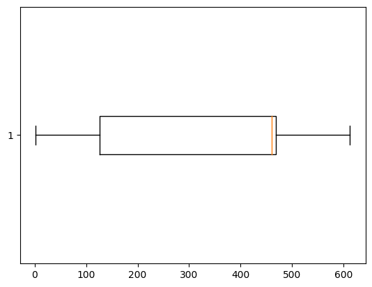
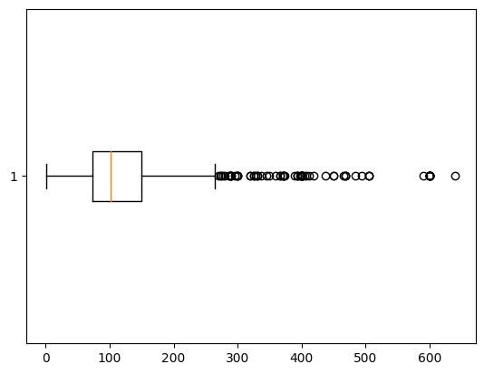
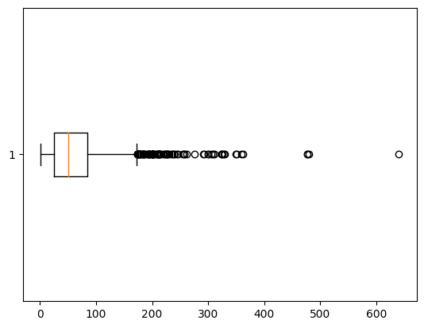
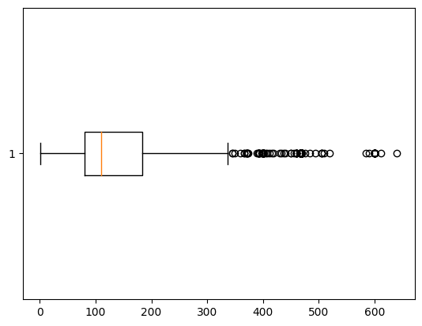
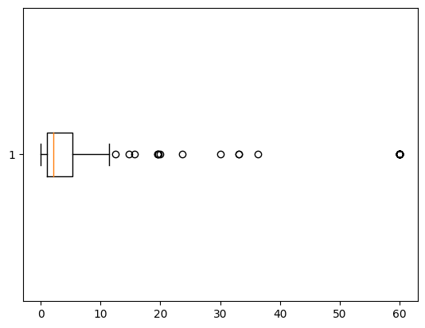

# Exploring the Data.
### The data utilized is titled, "Internet Advertisements Data Set". It was created and donated by Nicholas Kushmerick in 1998. It can be found [here](https://archive.ics.uci.edu/ml/datasets/Internet+Advertisements).

There are: 
1) 3279 Instances
2) 1558 Features
    
    a. The first 3 features are continuous and have a significant amount of missing values. 910 of instances has missing values (~28%)

    b. While the fourth feature is binary it has 10 missing values.

    c. The last feature is the class feature that states whether the instance is an ad or not.

    d. The remaining features are binary features that cover the topics:

    1. url terms
    2. origurl terms 
    3. ancurl terms 
    4. alt terms 
    5. caption terms


<br>

## Which features are relevant to predicting whether it's an ad or not?

<br>
1. It looks as though the width has a clear pattern. Based on my exploration, the width of the ads are much larger than nonads. This can be witnessed in the boxplots below.

<br>

### Ad Width


<br>

### Nonad Width


<br>
2.  I confirmed this finding by utilizing .corr(method='spearman'). I utilized spearman because it is a non-parametric test and I know at least the first three features are not normally distributed.

```
c = df.corr(method='spearman').abs().unstack().transpose()
c=c.drop_duplicates()
so = c.sort_values(ascending=False, kind="quicksort")
cdf.columns = cdf.columns.map(lambda x: f'column_{x+1}')
relevant=cdf[(cdf.column_1 == "column_1559") | (cdf.column_2 == "column_1559")]
print(relevant)
```
There were eleven features that had a score of .40 or higher.
Feature Name | Class Cloumn | Score
-------|---------|------
column_1244 | column_1559 | 0.5995815871346598
column_1400 | column_1559 | 0.5041172238333936
column_352 | column_1559 | 0.491136305115466
column_1484 | column_1559 | 0.4555715648824901
column_1456 | column_1559 | 0.4464083220786091
column_1436 | column_1559 | 0.441620040248294
column_1345 | column_1559 | 0.4309081143131397
column_2 | column_1559 | 0.4221407339037212
column_969 | column_1559 | 0.4177098519544056
column_1154 | column_1559 | 0.4084579031826451
column_1144 | column_1559 | 0.4026760673509376

Column_2 (Width) comes in at #8 in terms of the highest score.

I don't find the documentation of the data specific enough to attribute the feature names in the table above to any of the following five categories of features.
  1. url terms
    2. origurl terms 
    3. ancurl terms 
    4. alt terms 
    5. caption terms

If the documentation was more specific I would be able to attribute one or two (or potentially more) to being more influential in determining if an instance is an ad or not.

<br>

## What are some of the central tendencies about your data? How is this information relevant to the ML task?

<br>
This information is relevant to the task because how the data is spread can impact the performance of the model. Knowing the central tendancies can alert to whether data is normally distributed or not. This is statistically significant. It can also clue you into which features are correlated or especially relevant.

<br>
<br>
The features with the most descriptive central tendancies are found in the first 3 features.

Central Tendancy  | Height      | Width | Aspect Ratio
------------- | ------------- |--------| ------
Mean  | 63.9  | 155.6 | 3.9
Median  | 51.0  | 110.0| 2.1
Mode | 60.0      |468.0 | 1.0

Based on these values it is clear that the data is skewed to the right. The data is not normally distributed.
### Below are boxplots of the first 3 columns:

Column 1 (Height):



<br>
Column 2 (Width):



<br>
Column 3 (Aspect Ratio):



<br>

## Did you find any interesting findings or extreme values (outliers) that you need to disclose?

<br>

1. As documented in the boxplots above there were a number outliers in the first three features. Recognizing outliers is important because their presence can lead to overfitting.
2. As previously mentioned the values for the first three features are not normally distributed.
2.   There were many features (128) that only contained one value for every instance.