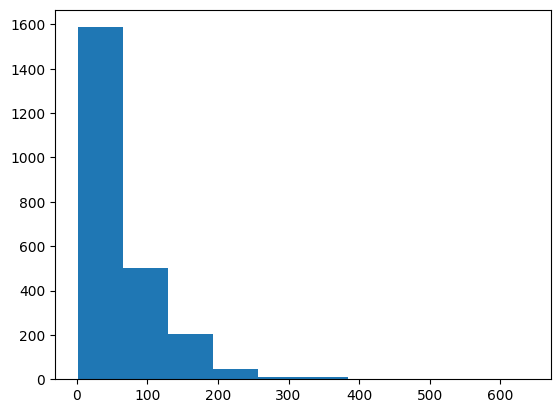
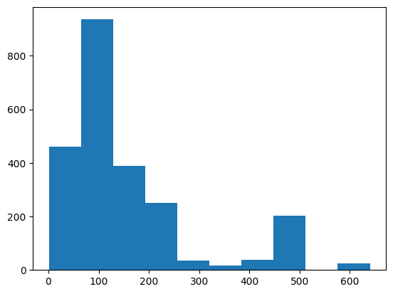
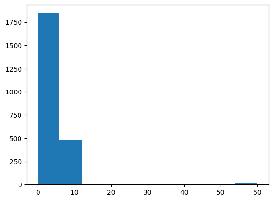
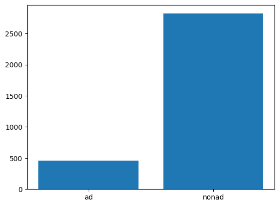
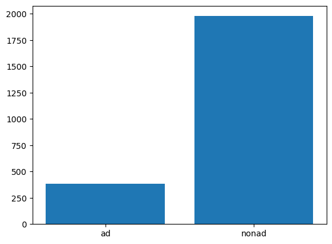

# Feature Engineering
<br>

## What features did you engineer and what was your reasoning behind them?

1. I dropped 128 features. Through exploring the data I found 128 features that only contained one value. I felt as though it would be beneficial to remove them because these features did not provide any differentiating features or value about the data. By removing them I lighted the storage and memory needed. I found the features with only one value utilizing the code below:
<br>

```
list=[] # making empty list
# Iterate over columns
for column in df:
     
    # The below code goes column by column to see which ones only have 1 value
    column_max=df[column].max() # Finding column max
    column_min=df[column].min() # Finding column min
    if column_max == column_min: # If the min and max are the same
        list.append(column) # Add the column name to the list
```

<br>
2. I encoded the class feature. I made 'ad.' 1 and 'nonad.' 0. This made the column digestible for keras/tensorflow.
<br>

<br>

```
df["column_1559"]= np.where(df["column_1559"]=='ad.', 1, 0)
```


<br>
3. I engineered the first four features that contained information regarding the height, width, and the aspect ratio of each instance. About ~28% of instances had missing values in these columns and I had to decide how to handle this. I considered imputing values and inserting either the mean or the median. Ultimately, I decided to drop the instances with missing values as the distribution of values within the first three features are not normally distributed. 
<br>
<br>

```
df = df[(df.column_1 != "   ?") & (df.column_2 != '   ?') & (df.column_3 !='     ?') & (df.column_4 !='?') ] # Subsetting to get rid of missing values
```
<br>

### Below are histograms of the first 3 columns:
<br>
Column 1 (Height):



<br>
Column 2 (Width):



<br>
Column 3 (Aspect Ratio):



<br>

I will also note that the fourth feature had ten missing values. I dropped those instances as well.

In total, 920 instances were dropped. I felt comfortable dropping those rows as there was still a comfortable class distribution. 


<br>

## Class Distribution prior to drop:
<br>
ad: 458

nonad: 2821

16.24% ad instances



<br>

## Class Distribution after drop:
<br>
ad: 381

nonad: 1978

19.26% ad instances




<br>

## Did you apply any scaling or normalization? If so, why?

<br>

I did apply scaling. I utilized the MinMaxScaler from sklearn. I did this on the first three features. They represented the height, width, and aspect ratio of every instance.

I did this because most of the other features other than the first few contained values such as 0 or 1. If I had not scaled the first 3 features the model would have weighted them heavier than the others because of their relative size.

Here is the code I utilized below:

```
scaler = MinMaxScaler() # Initializing scaler
X_train_scaled = scaler.fit_transform(X_train) # Scaling X_train
X_test_scaled = scaler.fit_transform(X_test) # Scaling X_test
```

